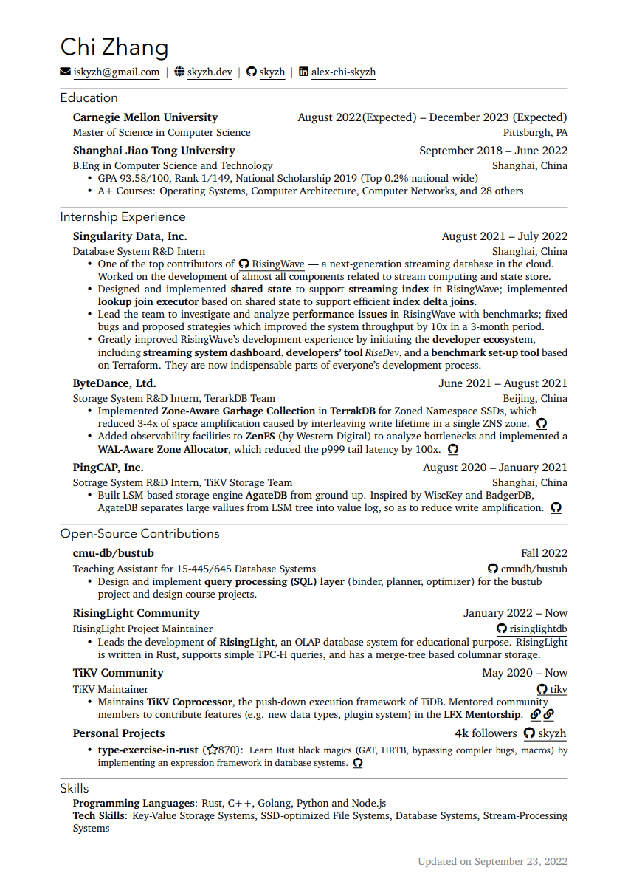

# CV — Yubo Huang

Source for my curriculum vitae. Built with XeLaTeX using the [`chicv`](https://github.com/matchy233/chi-cv-template) class (a slim CV template by Matchy, in turn based on [Alex Chi Zhang's CV](https://skyzh.github.io/files/cv.pdf)).

The latest rendered PDF lives at [`resume.pdf`](resume.pdf).



## Building

Requires a TeX Live distribution with `xelatex` and the `fontspec`, `fontawesome5`, `xifthen`, `xparse`, `enumitem`, `titlesec`, `fancyhdr`, and `hyperref` packages (all standard).

```sh
xelatex resume.tex
```

The fonts (XCharter and Avenir Next LT Pro) ship in [`fonts/`](fonts/) and are picked up automatically when not installed system-wide.

## Layout

| Path | Purpose |
| --- | --- |
| `resume.tex` | CV content. |
| `chicv.cls` | Document class: page layout, fonts, `\cventry`, `basicinfo`, contact-link macros. |
| `fonts/` | Bundled fonts used as a fallback by the class. |
| `img/` | Preview image used in this README. |
| `resume.pdf` | Latest build, committed for convenience. |

## License

Class file and original template: MIT, see [LICENSE](LICENSE). CV content (`resume.tex`) is © Yubo Huang.
